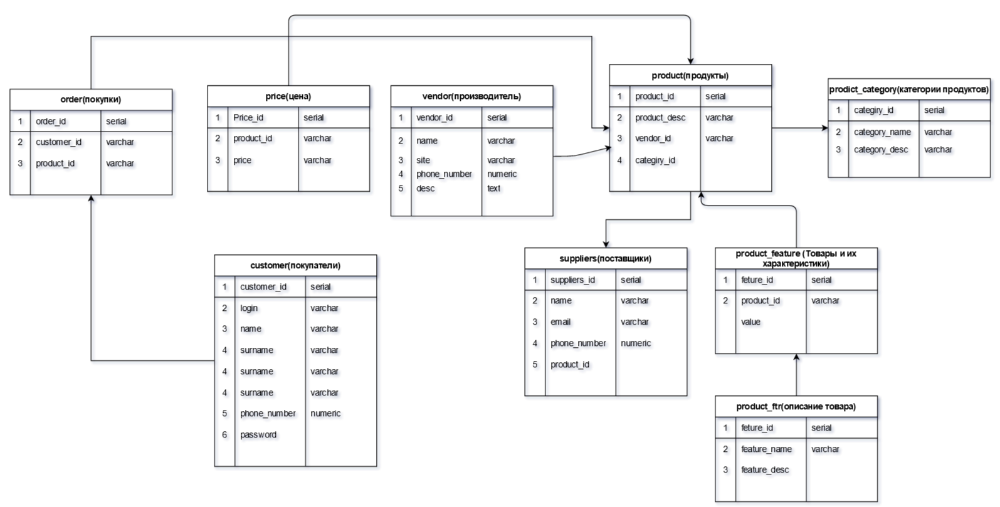

# Домашнее задание №1
- Построение модели данных:
Начинаем готовить дипломный проект. “Интернет-магазин”
Реализуйте сущности продукты, категории продуктов, цены, поставщики, производители, покупатели и покупки. 
Свои решения для этой схемы приветствуются

таблицы:
- Table product (Справочник продуктов)
- Table customer(покупатели)
- Table order(покупки)
- Table price(цена)
- Table product_category (категории продуктов)
- Table product_feature (Товары и их характеристики)
- Table product_ftr(описание товара)
- Table suppliers(поставщики)